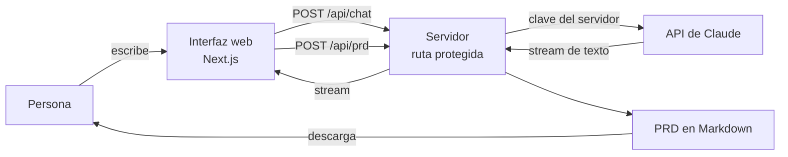

# Copiloto PRD

Aplicación web que entrevista a una persona **sin formación técnica** y convierte
su idea en un **PRD** (documento de requisitos de producto) descargable, listo
para que alguien —o un modelo de IA— empiece a construir.

La entrevista la conduce Claude siguiendo doce bloques de descubrimiento: una
pregunta a la vez, sin jerga, obligando a que cada requisito sea verificable.

---

## Por qué existe

Una idea vive en la cabeza de quien la tuvo. Cuando esa persona no sabe hablar el
idioma del desarrollo, pasa una de dos cosas: paga por algo que no era lo que
quería, o no arranca nunca. El hueco no es de talento, es de **traducción**.

Este producto ocupa ese hueco: convierte una conversación desordenada en un
documento estructurado, y señala explícitamente lo que no se habló en lugar de
rellenarlo con suposiciones.

---

## Cómo funciona



El navegador **nunca** ve la clave de la API. Todas las llamadas al modelo pasan
por una ruta de servidor propia, que es donde vive el secreto y donde se aplican
los límites de uso.

---

## Decisiones de diseño que vale la pena conocer

| Decisión | Por qué |
|---|---|
| Next.js con rutas de servidor, no una página estática | Una página estática solo puede llamar al modelo desde el navegador, y eso obliga a exponer la clave a cualquiera que abra las herramientas de desarrollo. |
| El prompt vive aislado en `lib/prompt.ts` | Es el activo de producto: cambia más seguido que el código y debe poder revisarlo alguien que no programa. |
| Marcador de progreso oculto en el stream | El modelo cierra cada turno con `[[BLOQUE: n/12 - nombre]]`. La interfaz lo lee para la barra de avance y lo borra antes de mostrar el texto. Evita una segunda llamada al modelo solo para preguntar por dónde va la conversación. |
| Modo demo sin clave | Permite probar el 100% del flujo sin gastar crédito ni exponer secretos, y hace que la app se degrade con un aviso en lugar de romperse si falta la variable de entorno. |
| Dos rutas separadas (`/api/chat` y `/api/prd`) | Son tareas distintas, con distinto límite de tokens y distinta tolerancia a la latencia. Unirlas obligaría a dimensionar ambas por la más exigente. |
| Límite de uso en memoria | Defensa mínima para un MVP. **Limitación conocida:** en serverless el contador no se comparte entre instancias. Producción requiere un almacén compartido (Vercel KV, Upstash Redis). |

---

## Variables de entorno

| Variable | Obligatoria | Para qué |
|---|---|---|
| `ANTHROPIC_API_KEY` | Sí (si no, arranca en modo demo) | Clave de la API de Anthropic. Solo se configura en el panel de Vercel; nunca en el código. |
| `ANTHROPIC_MODEL` | No | Modelo a usar. Por defecto `claude-sonnet-4-5`. |
| `ACCESS_CODE` | No | Si se define, la app pide ese código antes de conversar. Evita que una URL pública consuma crédito abiertamente. |
| `RATE_LIMIT_PER_HOUR` | No | Mensajes por hora y por visitante. Por defecto 40. |

---

## Ejecutar en local

```bash
npm install
cp .env.example .env.local   # opcional: sin clave arranca en modo demo
npm run dev
```

Abre `http://localhost:3000`.

---

## Desplegar

1. Subir este repositorio a GitHub.
2. En Vercel: **New Project → Import** el repositorio.
3. En **Environment Variables**, añadir `ANTHROPIC_API_KEY`.
4. **Deploy**. Vercel detecta Next.js sin configuración adicional.

---

## Estructura

```
app/
  page.tsx            Interfaz de la conversación
  layout.tsx          Estructura base y metadatos
  globals.css         Estilos
  api/chat/route.ts   Conversación con el modelo (stream)
  api/prd/route.ts    Generación del documento final
  api/estado/route.ts Estado del servidor (demo / código de acceso)
lib/
  prompt.ts           Comportamiento del copiloto y bloques de descubrimiento
  demo.ts             Guion de respuestas para el modo sin clave
  guard.ts            Código de acceso y límite de uso
```
